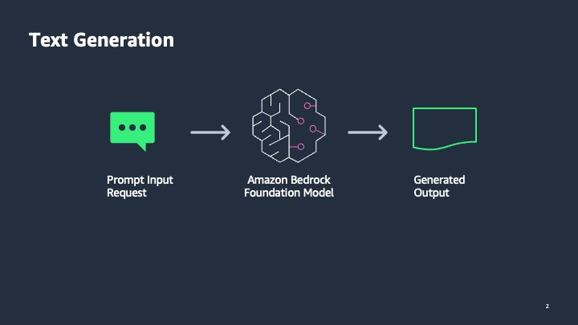

## Overview

In this workshop, you will learn how to generate text using LLMs on Amazon Bedrock. We will demonstrate the use of LLMs using the Bedrock API as well as how to utilize the LangChain framework that integrates with Bedrock. 

We will first generate text using a zero-shot prompt. The zero-shot prompt provides instruction to generate text content without providing a detailed context. We will explore zero-shot email generation using two approaches: Bedrock API (BoTo3) and Bedrock integration with LangChain. Then we will show how to improve the quality of the generated text by providing additional context in the prompt.  

## Audience

Architects and developer who want to learn how to use Amazon Bedrock LLMs to generate text. 
Some of the business use cases for text generation include:

- Generating Product descriptions based on product features and benefits for marketing teams
- Generation of media articles and marketing campaigns
- Email and reports generation

## Time needed

Each notebook can be run end-to-end in about 3 minutes each. Bedrock models provide a managed endpoint and are called synchronously in these notebooks.

## Cost

Amazon Bedrock pricing will be determined when it goes GA, and it is free to use during the limited preview. If you run the client in SageMaker Studio in the Bedrock account an ml.t3.medium for running the client costs $0.05 per hour. You can also run the client from outside of AWS.

## Pre-requisites

You should have completed the "Pre-requisites and Environment Setup" section in the workshop instructions.

## Workshop Notebooks

We will generate an email response to a customer where the customer had provided negative feedback on service received from a customer support engineer. The text generation workshop includes the following three notebooks. 
1. **00_generate_w_bedrock.ipynb** - Invokes Amazon Titan large text model using Bedrock API to generate an email response to a customer. It uses a zero-shot prompt without context as instruction to the model. 
1. **01_zero_shot_generation.ipynb** - Invokes Anthropic's Claude Text model using the LangChain framework integration with Bedrock to generate an email to a customer. It uses a zero-shot prompt without context as instruction to the model. 
1. **02_contextual_generation.ipynb** - We provide additional context in the prompt which includes the original email from the customer that we would like the model to generate a response for. The example includes a custom prompt template in LangChain, so that variable values can be substitued in the prompt at runtime.  

## Architecture

    
  

