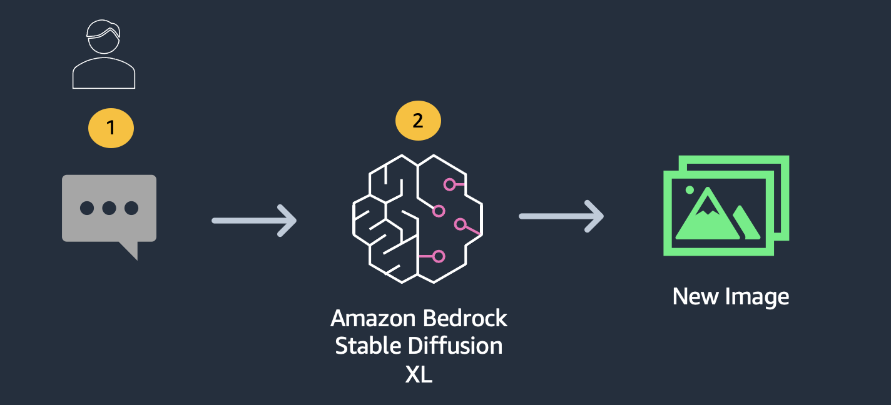
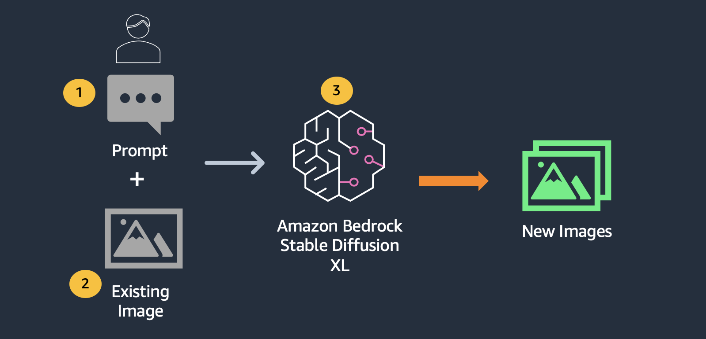

### Overview

Image generation can be a tidious task for artists, designers and content creators who illustrate their thoughts with the help of images. With the help of Foundation Models (FM) this tidious task can be streamlined to just a single line of text that expresses the thought of the artist, FMs can be used for creating realistic and artistic images of various subjects, environments, and scenes from language prompts.

In this lab we will explore how to use a foundation model available with Amazon Bedrock to generate images as well as modify existing images.

### Image prompting

Writing a good prompt can sometime be an art. It is often difficult to predict whether a certain prompt will yield a satisfactory image with a given model. However, there are certain templates that have been observed to work. Broadly, a prompt can be roughly broken down into three pieces: (i) type of image (photograph/sketch/painting etc.), (ii) description (subject/object/environment/scene etc.) and (iii) the style of the image (realistic/artistic/type of art etc.). You can change each of the three parts individually to generate variations of an image. Adjectives have been known to play a significant role in the image generation process. Also, adding more details help in the generation process.To generate a realistic image, you can use phrases such as “a photo of”, “a photograph of”, “realistic” or “hyper realistic”. 

To generate images by artists you can use phrases like “by Pablo Piccaso” or “oil painting by Rembrandt” or “landscape art by Frederic Edwin Church” or “pencil drawing by Albrecht Dürer”. You can also combine different artists as well. To generate artistic image by category, you can add the art category in the prompt such as “lion on a beach, abstract”. Some other categories include “oil painting”, “pencil drawing, “pop art”, “digital art”, “anime”, “cartoon”, “futurism”, “watercolor”, “manga” etc. You can also include details such as lighting or camera lens such as 35mm wide lens or 85mm wide lens and details about the framing (portrait/landscape/close up etc.).

Note that model generates different images even if same prompt is given multiple times. So, you can generate multiple images and select the image that suits your application best.

## Foundation Model

To provide this capability, Amazon Bedrock supports a propreitary foundation model, [Stable Diffusion XL](https://stability.ai/stablediffusion) for image generation from Stability AI. Stable Diffusion works on the principle of diffusion and is composed of multiple models each having different purpose:

1. The CLIP text encoder;
2. The VAE decoder;
3. The UNet, and
4. The VAE_post_quant_conv

The workings can be explained with this architecture:

## Target Audience

Marketing companies, agencies, web-designers, and general companies can take advantage on this feature to generate brand new images, from scratch.

## Patterns

In this workshop, you will be able to learn following patterns on Image Generation using Amazon Bedrock:

1. [Text to Image](./Bedrock%20Stable%20Diffusion%20XL.ipynb)
    
2. [Image to Image (In-paiting)](./Bedrock%20Stable%20Diffusion%20XL.ipynb)
    

## Helper
To facilitate image generation there is a utility class `Bedrock` implementation under `/utils/bedrock.py`. This helps you to generate images easily.

You can also explore different `style_preset`  options [here](https://platform.stability.ai/docs/features/animation/parameters#available-styles).